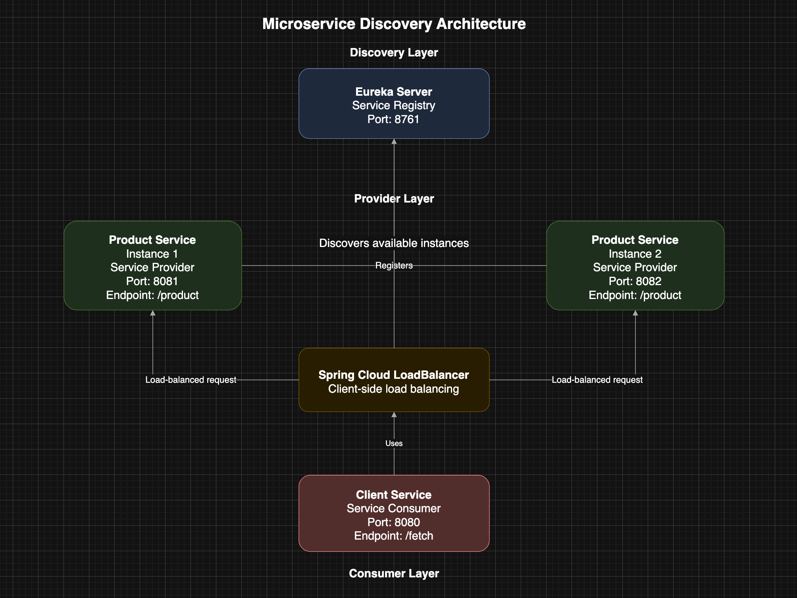
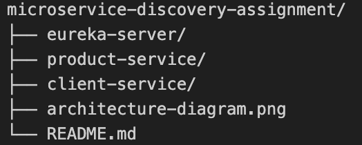
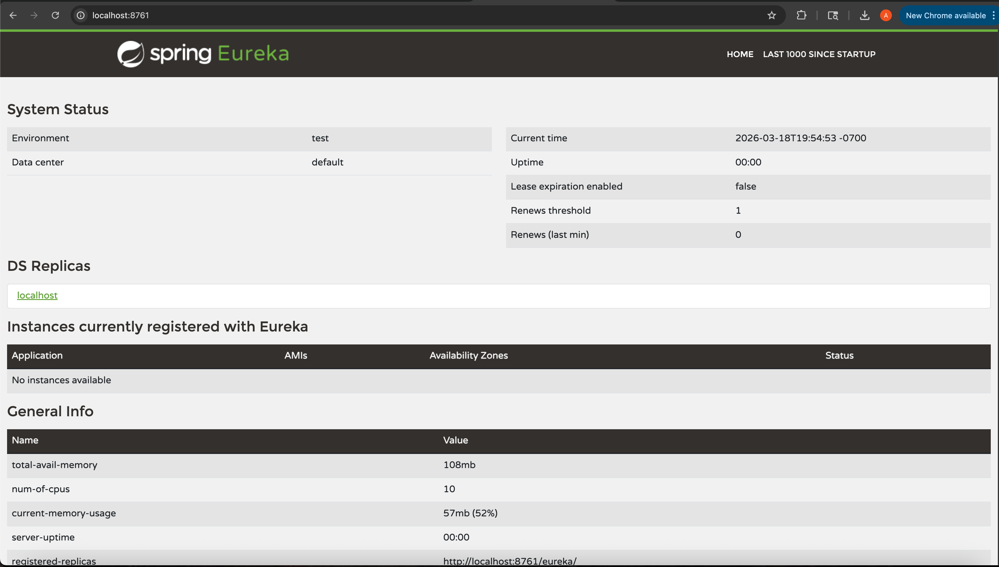
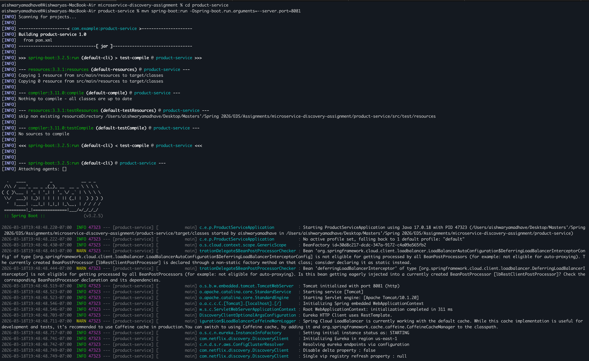
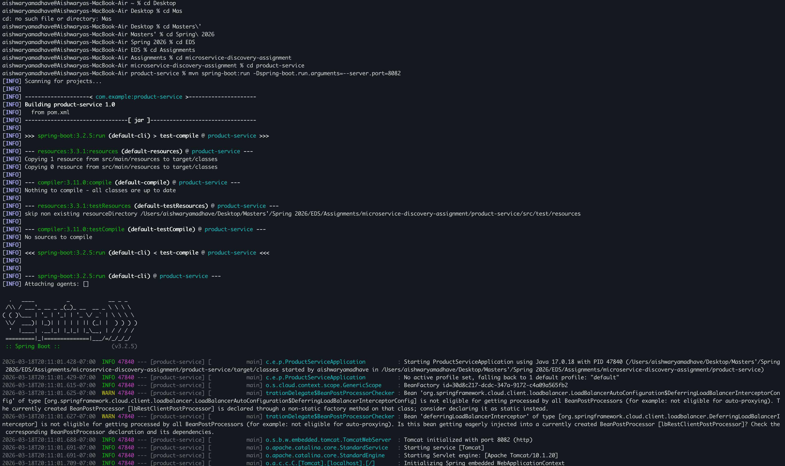
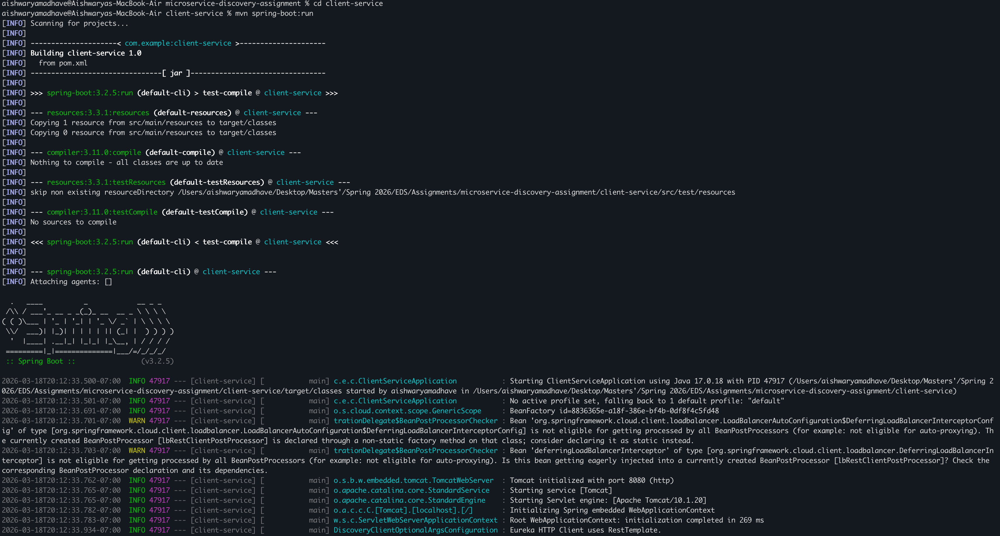
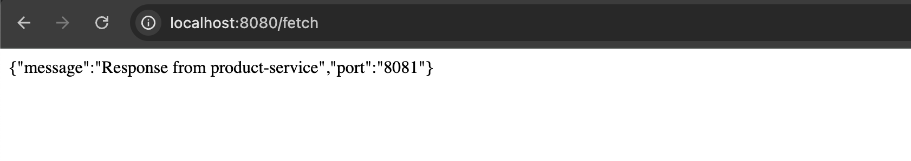
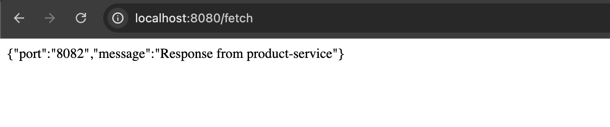
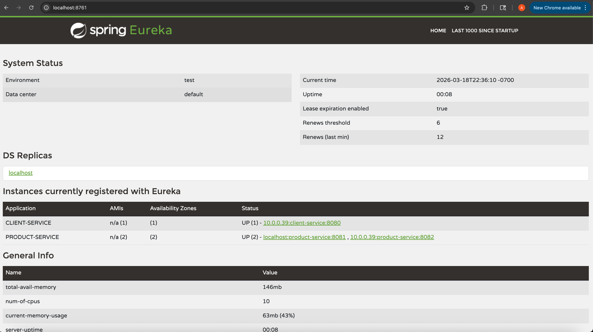

# Microservice Discovery Assignment

## Overview
This project demonstrates **service discovery in a microservices architecture** using Spring Boot and Eureka.

It includes:
- Eureka Server (Service Registry)
- Product Service (2 instances)
- Client Service (Service Consumer with discovery)

----------------------------------------------------------------------------------------------------------------------------------------------

## Architecture
Client Service calls Product Service via Eureka.



----------------------------------------------------------------------------------------------------------------------------------------------

## Technologies Used
- Java 17
- Spring Boot 3.2.5
- Spring Cloud Eureka
- Spring Cloud LoadBalancer
- Maven
- VS Code / IntelliJ

----------------------------------------------------------------------------------------------------------------------------------------------

## Project Structure




----------------------------------------------------------------------------------------------------------------------------------------------

## Services Description

### 1. Eureka Server
- Acts as a **service registry**
- All services register here
- URL: http://localhost:8761

----------------------------------------------------------------------------------------------------------------------------------------------

### 2. Product Service
- Provides API: `/product`
- Returns instance details (port number)
- Runs in **2 instances**:
  - Instance 1 → http://localhost:8081
  - Instance 2 → http://localhost:8082

----------------------------------------------------------------------------------------------------------------------------------------------

### 3. Client Service
- Provides API: `/fetch`
- Calls Product Service using service discovery
- Runs on:
  - http://localhost:8080

----------------------------------------------------------------------------------------------------------------------------------------------

## Prerequisites
- Java 17 installed
- Maven installed
- Ports 8080, 8081, 8082, and 8761 available

----------------------------------------------------------------------------------------------------------------------------------------------

## Run the Project

### Step 1: Start Eureka Server
```bash
cd eureka-server
mvn spring-boot:run
```



----------------------------------------------------------------------------------------------------------------------------------------------

### Step 2: Start Product Service (2 Instances)

Run Instance 1:
```bash
mvn spring-boot:run -Dserver.port=8081
```


Run Instance 2:
```bash
mvn spring-boot:run -Dserver.port=8082
```



----------------------------------------------------------------------------------------------------------------------------------------------

### Step 3: Start Client Service
```bash
cd client-service
mvn spring-boot:run
```



----------------------------------------------------------------------------------------------------------------------------------------------

## Testing the Application

Open in browser or use curl:

```bash
curl http://localhost:8080/fetch
```

### Expected Behavior
- First request → response from port 8081
- Next request → response from port 8082
- Requests alternate due to load balancing







----------------------------------------------------------------------------------------------------------------------------------------------

## Working
1. Services register themselves with Eureka on startup.
2. Eureka maintains a registry of all available services.
3. Client Service queries Eureka to locate Product Service instances.
4. Spring Cloud LoadBalancer distributes requests across instances.

----------------------------------------------------------------------------------------------------------------------------------------------

## Key Concepts Demonstrated
1. Microservices Architecture
2. Service Discovery
3. Client-side Load Balancing
4. Decoupled Communication
5. Dynamic Service Resolution

----------------------------------------------------------------------------------------------------------------------------------------------

## Observations
- Services are registered automatically with Eureka
- The client does not rely on fixed URLs
- Requests are distributed across instances
- The system is scalable and fault-tolerant

----------------------------------------------------------------------------------------------------------------------------------------------

## Author
- Aishwarya Madhave
- Course: Enterprise Distributed Systems
- Semester: Spring 2026